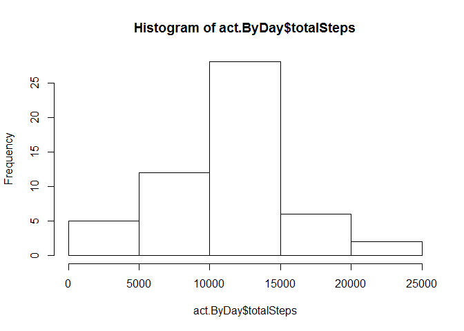
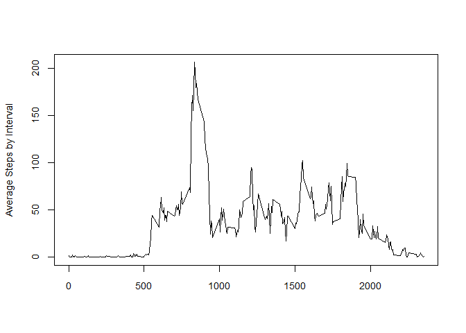
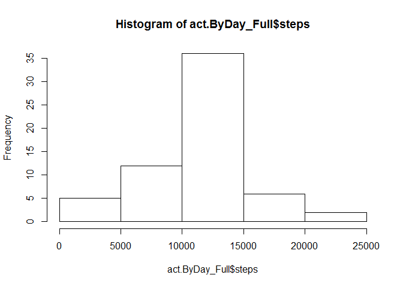
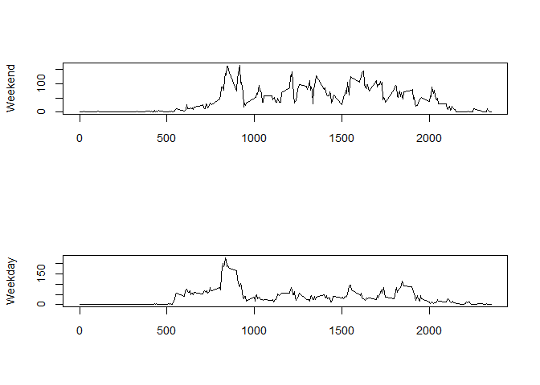

# Reproducible Research: Peer Assessment 1

## Loading and preprocessing the data

```r
setwd("G:/R/RepData_PeerAssessment1")

calcSummary <- function(x) {
  c(
      mean = mean(x)
    , median = median(x)
  )
}

act.Full <- read.csv(file="activity.csv",sep=",")
act.NALess <- act.Full[complete.cases(act.Full),]

act.ByDay <- aggregate(act.NALess$steps, list(act.NALess$date), sum)
colnames(act.ByDay) <- c("date", "totalSteps")

act.Summary <- calcSummary(act.ByDay$totalSteps)

act.AvgByDay <- aggregate(act.NALess$steps, list(act.NALess$interval), mean)
colnames(act.AvgByDay) <- c("interval", "avg_Steps")

act.MaxStepsInterval <- act.AvgByDay[act.AvgByDay$avg_Steps == max(act.AvgByDay$avg_Steps),]
```


## What is mean total number of steps taken per day?


```r
hist(act.ByDay$totalSteps)
```

 

The mean of steps is: 1.0766189\times 10^{4}.
The median of steps is: 1.0765\times 10^{4}.


## What is the average daily activity pattern?


```r
plot(act.AvgByDay$interval,act.AvgByDay$avg_Steps, type="l",xlab=""
     ,  ylab="Average Steps by Interval", cex.lab=0.9, cex.axis=0.9)
```

 

The max number of steps occourred in the interval number 835 with 206.1698113 steps.


## Imputing missing values


```r
TotalNA <- nrow(act.Full) - nrow(act.NALess)

act.Full$steps <- ifelse(is.na(act.Full$steps) == TRUE 
                         , act.AvgByDay$avg_Steps[act.AvgByDay$interval %in% act.Full$interval]  
                         , act.Full$steps)

act.ByDay_Full <- aggregate(act.Full$steps, list(act.Full$date), sum)
colnames(act.ByDay_Full) <- c("date", "steps")

act.Summary_Full <- calcSummary(act.ByDay_Full$steps)


hist(act.ByDay_Full$steps)
```

 

The Total number of NA is 2304
The mean of steps is: 1.0766189\times 10^{4}.
The median of steps is: 1.0766189\times 10^{4}.

## Are there differences in activity patterns between weekdays and weekends?


```r
wk <- c('Monday', 'Tuesday', 'Wednesday', 'Thursday', 'Friday')
act.Full$date <- as.Date(act.Full$date)
act.Full$wDay <- c('weekend', 'weekday')[(weekdays(act.Full$date) %in% wk) +1L]

act.AvgByDayFull <- aggregate(act.Full$steps, list(act.Full$interval,act.Full$wDay), mean)
colnames(act.AvgByDayFull) <- c("interval","wday", "avg_steps")
par(mfrow = c(2, 1))

act.AvgByDayFull_weekday <- act.AvgByDayFull[act.AvgByDayFull$wday == 'weekday',]
act.AvgByDayFull_weekend <- act.AvgByDayFull[act.AvgByDayFull$wday == 'weekend',]

plot(act.AvgByDayFull_weekend$interval,act.AvgByDayFull_weekend$avg_steps, type="l",xlab="",  ylab="Weekend", cex.lab=0.9, cex.axis=0.9)

plot(act.AvgByDayFull_weekday$interval,act.AvgByDayFull_weekday$avg_steps, type="l",xlab="",  ylab="Weekday", cex.lab=0.9, cex.axis=0.9)
```

 
